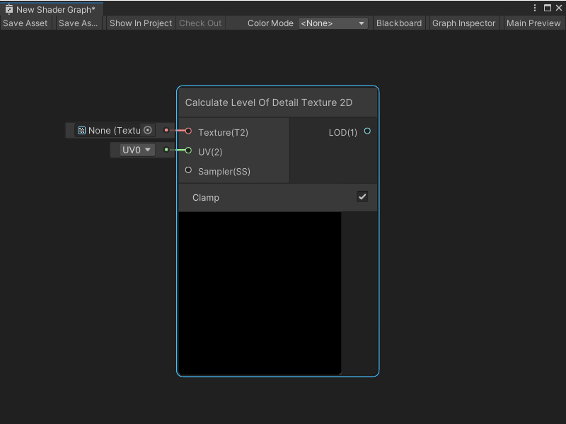
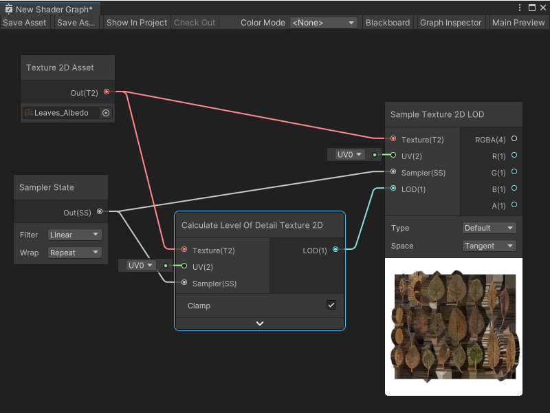

I wrote this reference topic as a part of the Node Library for Shader Graph at Unity Technologies. It lays out the information a user would need to use the node in a Shader Graph file.

<h1 id="calculate-level-of-detail-texture-2d-node">Calculate Level Of Detail Texture 2D node</h1>

The Calculate Level of Detail Texture 2D node takes an input <strong>Texture 2D</strong> and outputs the mip level of a Texture sample. This node is useful in situations where you need to know the mip level of a Texture, such as when you might want to modify the mip level before sampling in your shader.

The Calculate Level of Detail Texture 2D node also has a clamped and unclamped mode:

<ul>
<li>
<strong>Clamped</strong>: The node clamps the returned mip level to the actual mips available on the Texture. The node uses the <a href="https://docs.microsoft.com/en-us/windows/win32/direct3dhlsl/dx-graphics-hlsl-to-calculate-lod">CalculateLevelOfDetail</a> HLSL intrinsic function. Use this mode when you want to know which mip to sample your Texture from and restrict the result to an existing mip.

</li>
<li>
<strong>Unclamped</strong>: The node returns the ideal mip level, based on an idealized Texture with all its mips present. The node uses the <a href="https://docs.microsoft.com/en-us/windows/win32/direct3dhlsl/dx-graphics-hlsl-to-calculate-lod-unclamped">CalculateLevelOfDetailUnclamped</a> HLSL intrinsic function. Use this mode when you need a more generic value for your mip level.

</li>
</ul>

For example, a Texture might only have 3 mips: a 64×64 mip, a 32×32 mip, and a 16×16 mip. When you use the Calculate Level Of Detail Texture 2D node in its <strong>Clamped</strong> mode, the node restricts the <strong>LOD</strong> output to one of the 3 mips on the Texture, even if the ideal mip level might be a smaller resolution, such as an 8×8 version. In its <strong>Unclamped</strong> mode, the node outputs the ideal 8×8 mip level, even though it doesn&#39;t exist on the Texture.

<i class="far fa-sticky-note"></i><h5>Note</h5>
On platforms where these HLSL functions don&#39;t exist, Shader Graph determines an appropriate approximation to use, instead.

<h2 id="create-node-menu-category">Create Node menu category</h2>

The Calculate Level of Detail Texture 2D node is under the <strong>Input</strong> &gt; <strong>Texture</strong> category in the Create Node menu.

<h2 id="compatibility">Compatibility</h2>

The Calculate Level of Detail Texture 2D node is supported on the following render pipelines:

<table>
<thead>
<tr>
<th><strong>Built-In Render Pipeline</strong></th>
<th><strong>Universal Render Pipeline (URP)</strong></th>
<th><strong>High Definition Render Pipeline (HDRP)</strong></th>
</tr>
</thead>
<tbody>
<tr>
<td>Yes</td>
<td>Yes</td>
<td>Yes</td>
</tr>
</tbody>
</table>

The Calculate Level of Detail Texture 2D node can only be connected to a Block node in the <strong>Fragment</strong> Context. For more information on Block nodes and Contexts, see Master Stack.

<h2 id="inputs">Inputs</h2>

The Calculate Level of Detail Texture 2D node has the following input ports:

<table>
<thead>
<tr>
<th style="text-align:left"><strong>Name</strong></th>
<th style="text-align:left"><strong>Type</strong></th>
<th style="text-align:left"><strong>Binding</strong></th>
<th style="text-align:left"><strong>Description</strong></th>
</tr>
</thead>
<tbody>
<tr>
<td style="text-align:left"><strong>Texture</strong></td>
<td style="text-align:left">Texture 2D</td>
<td style="text-align:left">None</td>
<td style="text-align:left">The Texture to use in the mip level calculation.</td>
</tr>
<tr>
<td style="text-align:left"><strong>UV</strong></td>
<td style="text-align:left">Vector 2</td>
<td style="text-align:left">UV</td>
<td style="text-align:left">The UV coordinate to use to calculate the Texture&#39;s mip level.</td>
</tr>
<tr>
<td style="text-align:left"><strong>Sampler</strong></td>
<td style="text-align:left">SamplerState</td>
<td style="text-align:left">None</td>
<td style="text-align:left">The Sampler State and corresponding settings to use to calculate the Texture&#39;s mip level.</td>
</tr>
</tbody>
</table>
<h2 id="controls">Controls</h2>

The Calculate Level of Detail Texture 2D node has one control:

<table>
<thead>
<tr>
<th style="text-align:left"><strong>Name</strong></th>
<th style="text-align:left"><strong>Type</strong></th>
<th style="text-align:left"><strong>Options</strong></th>
<th style="text-align:left"><strong>Description</strong></th>
</tr>
</thead>
<tbody>
<tr>
<td style="text-align:left"><strong>Clamp</strong></td>
<td style="text-align:left">Toggle</td>
<td style="text-align:left">True, False</td>
<td style="text-align:left">When enabled, Shader Graph clamps the output mip level to the actual mips present on the provided <strong>Texture</strong> input. When disabled, Shader Graph returns an ideal mip level, based on an idealized Texture with all its mips present.</td>
</tr>
</tbody>
</table>
<h2 id="outputs">Outputs</h2>

The Calculate Level of Detail Texture 2D node has one output port:

<table>
<thead>
<tr>
<th style="text-align:left"><strong>Name</strong></th>
<th style="text-align:left"><strong>Type</strong></th>
<th style="text-align:left"><strong>Description</strong></th>
</tr>
</thead>
<tbody>
<tr>
<td style="text-align:left"><strong>LOD</strong></td>
<td style="text-align:left">Float</td>
<td style="text-align:left">The final calculated mip level of the Texture.</td>
</tr>
</tbody>
</table>
<h2 id="example-graph-usage">Example graph usage</h2>

In the following example, a Calculate Level of Detail Texture 2D node calculates the mip level of the <strong>Leaves_Albedo</strong> Texture for a set of UV coordinates and a specific Sampler State. It sends the calculated mip level for the Texture to the <strong>LOD</strong> input port on a Sample Texture 2D LOD node, which samples the same Texture:

<h2 id="related-nodes">Related nodes</h2>

The following nodes are related or similar to this node:

<ul>
<li>Sample Texture 2D LOD node</li>
<li>Sampler State node</li>
<li>Gather Texture 2D node</li>
<li>Texture 2D Asset node</li>
</ul>
